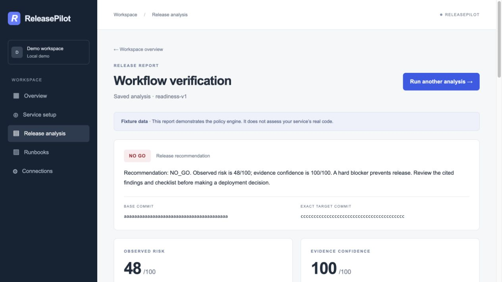
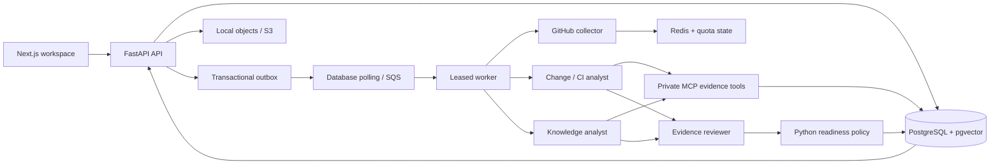

# ReleasePilot

ReleasePilot turns release evidence into a reviewable **GO / CAUTION / NO_GO** report. It combines GitHub changes, exact-commit CI results, PR reviews, and deployment runbooks. Bounded specialist agents explain the evidence; ordinary Python owns the risk score, confidence score, and hard blockers.

Built with **Next.js, TypeScript, FastAPI, PostgreSQL/pgvector, Redis, MCP, and the OpenAI API**, with S3/SQS adapters and a prepared ECS deployment template.



## Run locally

Requirements: Docker Desktop with Compose, plus Python 3 for setup and the smoke script. No GitHub, OpenAI, or AWS credentials are needed for the fixture workflow.

```sh
python3 scripts/configure-local.py
docker compose up -d --build
```

Open **http://localhost:3000**. The local account is `demo@releasepilot.local` / `local-demo-change-me`. These defaults are for the loopback-only local environment. The setup script generates private service secrets in the ignored `.env`; do not commit that file.

1. Sign in and create a service, or use the seeded example.
2. Open **Release analysis**, choose a fixture, and start an analysis.
3. Inspect the decision, risk/confidence breakdown, findings, evidence citations, and checklist.
4. Expand **Analysis activity** to see the analyst/reviewer stages and MCP calls.
5. Open **Runbooks**, upload a Markdown/text/PDF document, and inspect retrieved passages.

```sh
python3 scripts/smoke.py        # Real local HTTP, worker, PostgreSQL, MCP, upload + retrieval

docker compose logs --tail 80 worker api mcp
docker compose down            # Stops containers; preserves reports and uploaded documents
```

Do not use `docker compose down -v` if you want to keep your local data.

## What works

- Session-cookie authentication, CSRF/origin checks, login throttling, and workspace-scoped records.
- Public-repository access or GitHub App installation authorization; branch/tag/SHA selection with immutable SHA resolution.
- Bounded GitHub comparison, PR/review, check-run and commit-status collection. Required checks are bound to App identity where available. Missing permissions, incomplete pagination, pending results, and stale SHAs never imply passing checks.
- Markdown, UTF-8 text and text-based PDF ingestion; overlapping chunks with headings/page provenance; PostgreSQL vector plus full-text retrieval with reciprocal-rank fusion and workspace/service filtering before ranking.
- A private HTTP MCP server exposing six fixed read-only tools. Role allowlists, signed job context, lease checks, scope validation, output bounds, and global/per-agent call budgets are enforced server-side.
- Parallel change/CI and knowledge specialists, then an evidence reviewer. Structured output, one schema-repair attempt, citation/quote validation, bounded time/tokens/cost, and input-hashed resumable agent runs.
- Deterministic category caps, hard blockers, separate evidence confidence, actionable checklists, and saved reports that are read without recomputation.
- PostgreSQL job leases, fenced final writes, stage checkpoints, retries, transactional outbox, SQS transport/DLQ adapter, and reconciliation. Default Compose uses database polling so it needs no cloud emulator.
- Signed, deduplicated GitHub webhooks, asynchronous cache invalidation, conservative stale-report annotations, Redis failure fallback, in-process request deduplication, and shared provider cooldowns.
- CI for types/lint/tests, schema drift, migration round trips, container builds, and local smoke checks. Manual ECR publishing and validated CloudFormation deployment files are included.

## What the demo proves—and what it does not

The fixture source is synthetic and explicitly labeled. It runs through the real background worker and MCP HTTP transport, but uses deterministic agent handoffs and does not call an LLM. With no OpenAI key, uploaded documents use `demo-hash-v1` text vectors; this is a retrieval plumbing demonstration, not a semantic-embedding quality claim.

The live GitHub and OpenAI adapters are implemented, but **authenticated live-provider behavior has not been verified with this repository's credentials**. AWS files are prepared and validated, **not deployed**. S3/SQS adapter tests use Moto. Offline policy/security evaluations are separate from live-model quality evaluation. Do not describe the project as AWS-deployed or quote real-user/production impact yet.

When live GitHub analysis has no model key, the report remains partial rather than claiming a completed AI review. Missing required-check policy also produces a conservative result. Checks apply to the exact selected SHA, not the newest convenient passing result.

## Connect GitHub and OpenAI later

For a public repository, open **Connections**, enter `owner/repository`, and connect. Unauthenticated GitHub access has a smaller shared quota and may not expose required-check policy.

For a GitHub App:

1. Create an App with read-only **Contents, Pull requests, Checks, Commit statuses, Metadata, and Administration** permissions. Administration read access is used to inspect branch protection/rules. Subscribe to `push`, `pull_request`, `pull_request_review`, `check_run`, `check_suite`, `status`, `installation`, and `installation_repositories` events.
2. Configure callback `${APP_ORIGIN}/api/v1/github/callback` and webhook `${APP_ORIGIN}/api/v1/webhooks/github`. GitHub cannot deliver webhooks to localhost; use your own HTTPS deployment/tunnel when you want to test them.
3. Set the App ID, slug, OAuth client ID/secret, and webhook secret in `.env`. Put its PEM private key in `.secrets/github-app.pem` and set `GITHUB_APP_PRIVATE_KEY_FILE=/run/secrets/github-app.pem`. The directory is ignored and mounted read-only. AWS can inject PEM text through `GITHUB_APP_PRIVATE_KEY` instead.
4. Recreate the containers with `docker compose up -d`. In **Connections**, install the App, authorize your installation, then select that authorized installation and repository. Installation IDs supplied by a user are checked against their short-lived GitHub authorization grant.
5. Set `OPENAI_API_KEY` locally to enable model reasoning and `text-embedding-3-small` embeddings. Reindex older documents to replace demo vectors. Reports retain the evidence captured at analysis time.

Default reasoning model: `gpt-4.1-mini`. Per-agent limits: 120 seconds, 32,000 cumulative token budget, and $0.06 estimated maximum using a conservative configurable $1.60/million-token upper rate. Changing the model requires updating `MODEL_MAX_USD_PER_MILLION_TOKENS` and revalidating behavior. Bounds may produce a partial report on large inputs. Pricing assumptions are configuration, not billing guarantees. See the [official model page](https://developers.openai.com/api/docs/models/gpt-4.1-mini).

## Architecture



MCP tools serve scoped captured GitHub evidence and authorized runbook search. They do not accept credentials, arbitrary URLs, SQL, shell commands, deployment actions, or GitHub write actions from the model. GitHub collection is centralized before analyst fan-out, avoiding repeated evidence fetches by different agents.

## Development and verification

```sh
cd backend
uv sync --frozen
uv run ruff check .
uv run ruff format --check .
uv run mypy app
uv run pytest -q
uv run python -m evals.run
PYTHONPATH=. uv run python scripts/export_openapi.py
cd ../frontend
npm ci
npm run generate:api
npm run lint
npm run typecheck
npm test
npm run build
```

For PostgreSQL tests, set `TEST_DATABASE_URL` to a **separate disposable database ending in `_test`**. Tests recreate its tables. Never point it at the application database. CI exercises PostgreSQL/pgvector and upgrade/downgrade/upgrade migrations. SQLite is the fast default for most backend tests.

The local verification record, limitations, and exact measured gates are in [docs/verification.md](docs/verification.md). The 18-case offline evaluation output is [evals/results.json](evals/results.json). It measures deterministic policy/security behavior, not live-model accuracy.

## Repository guide

| Area | Purpose |
|---|---|
| `backend/app/scoring` | Pure policy and normalized evidence schemas |
| `backend/app/github` | Installation access, collection, quota/cache behavior |
| `backend/app/documents` | Uploads, object storage, extraction, embeddings and search |
| `backend/app/mcp_tools` | Private MCP server and HTTP client |
| `backend/app/agents` | Bounded orchestration and structured/cited handoffs |
| `backend/app/jobs` | Queue adapter, leases, checkpoints and worker |
| `backend/app/webhooks` | Signed ingress, deduplication and freshness handling |
| `frontend/app` | Workspace, setup, connections, runbooks and report screens |
| `backend/tests`, `backend/evals` | Unit/integration/security tests and offline gates |
| `infrastructure/aws` | CloudFormation template and template generator |

## Technical documentation

- [Architecture decisions and operational limits](docs/architecture.md)
- [Verification results](docs/verification.md)
