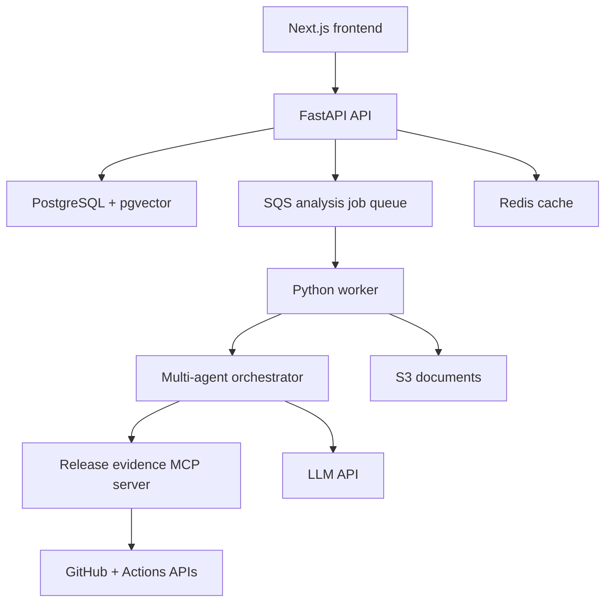
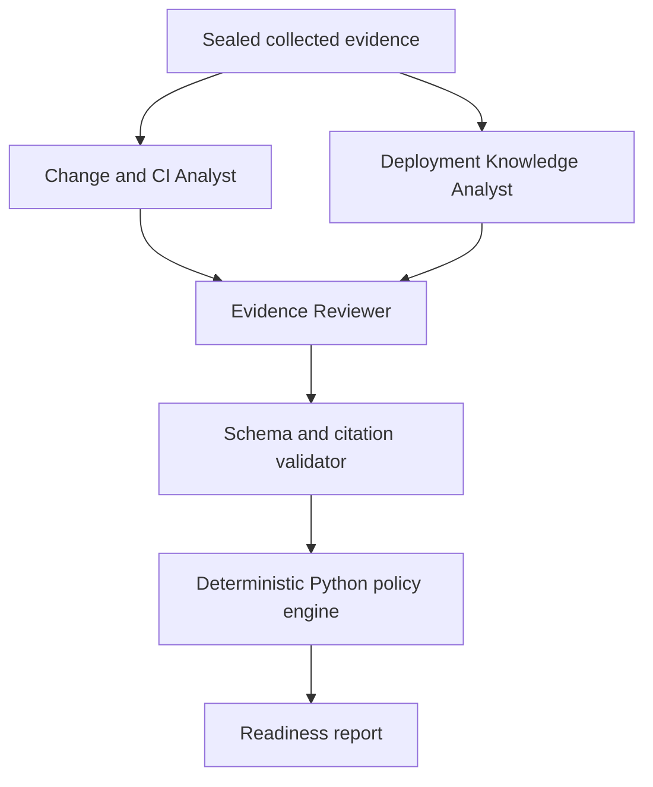

# ReleasePilot - Junior FDE Portfolio Project Specification

**Document purpose:** A realistic, learn-as-you-build specification for a resume-ready junior Forward Deployed Engineer / Full Stack Developer project  
**Primary stack:** Python, FastAPI, Next.js, TypeScript, PostgreSQL/pgvector, MCP, Docker, AWS  
**Status:** Scoped implementation plan  
**Last updated:** 2026-09-06  

---

## 1. Project Summary

ReleasePilot is a web application that helps a software team decide whether a release is ready to deploy.

A user connects a GitHub repository, selects a previous release and a target commit, and uploads a deployment runbook. ReleasePilot gathers the code changes, pull requests, reviews, GitHub Actions results, and relevant runbook guidance. A small orchestrated team of bounded AI agents investigates different parts of that evidence through typed MCP tools and produces:

- A release risk score.
- A separate evidence-confidence score.
- A `GO`, `CAUTION`, or `NO_GO` recommendation.
- Evidence-backed risks with links to GitHub or quoted runbook passages.
- Missing-test, missing-review, and missing-documentation warnings.
- A short pre-deployment checklist.

ReleasePilot does not deploy production software in the required version. It is a decision-support product. This keeps the project safe, achievable, and easy to demonstrate while still showing full-stack ownership, AI integration, RAG, tool calling, external APIs, Docker, AWS, testing, and product judgment.

### Ten-second explanation

> ReleasePilot checks the code changes, reviews, CI tests, and deployment documentation for a release, then explains whether it looks safe to deploy.

### Example

A developer attempts to release commit `8f27ab1`. ReleasePilot finds that:

- One required GitHub Actions test failed.
- A database migration changed.
- The runbook requires a backup before database changes.
- No completed-backup evidence was supplied.

The application returns `NO_GO`, cites the failed test and runbook section, and creates checklist items to fix the test and confirm a backup.

---

## 2. What This Project Must Prove to Recruiters

The project is successful if a recruiter or engineer can understand these points within a few minutes:

1. You identified a relatable engineering problem.
2. You designed and built the product end to end.
3. You integrated with a real external platform rather than using only mock data.
4. You used AI for a meaningful workflow rather than adding a generic chatbot.
5. You used RAG and citations to make AI output trustworthy.
6. You used structured tool calling through MCP.
7. You placed deterministic safeguards around the model.
8. You tested model behavior with repeatable scenarios.
9. You containerized and deployed the application.
10. You can explain your tradeoffs, failures, and next steps clearly.

### Junior-FDE bar

A junior FDE is not expected to have already designed global data-residency infrastructure, enterprise compliance programs, customer-managed VPC deployments, or dozens of production integrations. A strong junior project should instead show that you can:

- Turn an unclear business problem into a concrete workflow.
- Ask what evidence is needed to make a decision.
- Integrate APIs and normalize messy external data.
- Build a usable frontend and dependable backend.
- Add practical AI with validation and human-readable evidence.
- Deploy, observe, debug, test, and document the result.
- Learn unfamiliar tools while delivering a working product.

---

## 3. Scope Decisions

### 3.1 Required, resume-ready scope

- One user workspace with simple authentication.
- Connect one GitHub repository through a GitHub App.
- Select a base release/tag/commit and target branch/commit.
- Retrieve changed files, commits, pull requests, reviews, and GitHub Actions checks.
- Upload Markdown, text, or text-based PDF runbooks.
- Store and retrieve runbook chunks using PostgreSQL and pgvector.
- Three bounded specialist agents coordinated by a deterministic orchestration workflow.
- One MCP server exposing typed release-evidence tools.
- Structured Pydantic outputs and handoffs for every agent.
- Deterministic hard blockers and understandable risk scoring.
- Cited findings and a generated release checklist.
- Background analysis job with visible progress.
- Idempotent job processing with durable state, retries, and a dead-letter path.
- Signed GitHub webhooks with duplicate-delivery protection.
- Redis cache with explicit TTL and webhook-driven invalidation.
- Centralized GitHub rate-limit handling and backoff.
- Docker Compose development environment.
- AWS deployment using Docker containers.
- GitHub Actions CI/CD for the ReleasePilot repository.
- A small automated AI evaluation suite.
- A polished README and two-to-three-minute demo.

### 3.2 Valuable if time permits

- Read-only CloudWatch alarm evidence for the deployed demo application.
- Two roles: workspace admin and reviewer.
- Compare current analysis with a previous analysis.
- Export the report as JSON or a clean printable page.
- Email or webhook notification when analysis completes.
- Public demo mode using a seeded repository scenario.

### 3.3 Stretch features only

- Jira integration.
- Multiple repositories in one release.
- Slack notifications.
- Sentry integration.
- Approval workflow and simulated deployment button.
- Custom organization policies.
- Multiple workspaces/true SaaS multi-tenancy.
- Generic internal API or legacy database connector.

### 3.4 Explicitly out of scope

- Actual production deployment or rollback execution.
- Customer-VPC data planes.
- Multi-region data residency.
- SOC 2, ISO 27001, HIPAA, or other compliance claims.
- Custom machine-learning model training.
- Automatic code fixes.
- Arbitrary SQL, shell, or cloud-command execution.
- Kubernetes.
- Supporting every Git provider and CI system.
- Complex custom roles, two-person approval, and enterprise SSO.

These are not omissions that weaken the project. Removing them makes it more likely that the core experience will be complete, tested, deployed, and explainable.

---

## 4. Resume-Ready Definition

You may add ReleasePilot to your resume when all of the following are true:

- A new user can connect or use a demo GitHub repository.
- The user can select two valid Git refs and start an analysis.
- ReleasePilot retrieves real code/PR/check evidence.
- At least one runbook can be uploaded, indexed, retrieved, and cited.
- The three-agent workflow returns schema-valid handoffs and findings.
- Failed required CI produces a deterministic `NO_GO`.
- Missing evidence is shown as unknown, not incorrectly treated as passing.
- The report UI is polished and understandable.
- The project runs from a documented Docker Compose command.
- A deployed AWS version or recorded AWS deployment demonstration exists.
- Tests and at least 15 evaluation scenarios run in CI.
- Duplicate jobs and webhooks produce one logical result.
- Redis failure and GitHub throttling have tested fallback behavior.
- The README explains architecture, setup, safeguards, evaluation results, and tradeoffs.
- All resume metrics are measured from the completed project.

You do not need Jira, production deployment execution, true multi-tenancy, or customer-VPC support before adding it to your resume.

---

## 5. Core User Flow

### 5.1 First-time setup

1. User signs in.
2. User installs the ReleasePilot GitHub App on one selected repository.
3. ReleasePilot verifies repository access and displays the repository name/default branch.
4. User creates a service name, such as `Checkout API`.
5. User uploads a deployment runbook.
6. ReleasePilot parses and indexes the runbook.
7. Setup screen confirms that GitHub and knowledge search are ready.

### 5.2 Create an analysis

1. User selects the service/repository.
2. User selects a base ref, normally the last release tag or production commit.
3. User selects a target ref, normally `main` or a release branch.
4. Backend resolves both refs to immutable commit SHAs.
5. User optionally enters a short release description.
6. ReleasePilot previews the evidence it will collect.
7. User clicks **Analyze release**.

### 5.3 Evidence collection

The background worker retrieves:

- Commit comparison and changed files.
- Pull requests associated with the changes.
- Review/approval status.
- GitHub Actions check runs for the exact target SHA.
- Basic repository metadata.
- Relevant runbook chunks based on changed paths and release description.

The UI polls for status and displays stages such as:

- Collecting GitHub evidence.
- Searching runbooks.
- Investigating risks.
- Validating citations.
- Calculating recommendation.

### 5.4 Readiness report

The completed report displays:

- `GO`, `CAUTION`, or `NO_GO`.
- Risk score from 0 to 100.
- Confidence score from 0 to 100.
- Three-to-five sentence summary.
- Hard blockers at the top.
- Findings grouped by tests, code/reviews, and deployment readiness.
- Direct citations to GitHub checks, PRs, changed files, or runbook chunks.
- Generated checklist.
- Missing evidence section.
- Technical details accordion with tool calls and timing.

### 5.5 Rerun

If the target branch changes, the completed report remains immutable. The user starts a new analysis for the new target SHA. The application may show that an older analysis is stale, but it does not silently update history.

---

## 6. Product Requirements

### FR-1: Authentication and workspace

- User signs in with GitHub OAuth or a simple secure demo account.
- MVP contains one workspace per installation.
- Workspace owns repositories, runbooks, analyses, and settings.
- Authentication is required for all non-demo API routes.
- Workspace ownership is derived from the authenticated session, not accepted blindly from request JSON.

### FR-2: GitHub App connection

- User installs the App on selected repositories.
- Backend stores installation and immutable repository IDs.
- Tokens are generated server-side and never sent to the browser or LLM.
- Connection page shows repository, permissions, last successful request, and error state.
- App requests read permissions only for MVP.

### FR-3: Release selection

- User chooses base and head refs.
- Backend resolves refs to SHAs before creating an analysis.
- Identical refs are rejected.
- Unknown/inaccessible refs return a helpful error.
- Every report displays the exact analyzed SHAs.

### FR-4: GitHub evidence

- Compare base/head commits.
- List changed filenames, status, additions/deletions, and patch summary when available.
- Associate pull requests where GitHub data permits.
- Retrieve review state.
- Retrieve check suites/check runs for the head SHA.
- Preserve provider URLs for citations.
- Distinguish success, failure, cancelled, skipped, neutral, pending, and missing.

### FR-5: Runbook ingestion

- Accept `.md`, `.txt`, and text-based `.pdf`.
- Validate size and file type.
- Extract text and preserve headings/pages where possible.
- Split into chunks, generate embeddings, and store metadata.
- Show indexing progress and useful errors.
- Do not claim OCR support in MVP.

### FR-6: RAG retrieval

- Search only documents belonging to the current workspace/service.
- Combine vector similarity with PostgreSQL full-text search.
- Return source title, heading/page, chunk ID, and excerpt.
- Retrieve a small bounded set, such as top five chunks.
- Treat document instructions as evidence, not system instructions.

### FR-7: MCP tool integration

- ReleasePilot acts as an MCP client/host for one purpose-built evidence server.
- MCP tools have JSON Schema input definitions and bounded outputs.
- Analysis agent receives read-only tools only.
- Tool calls are logged with secrets redacted.
- Invalid arguments and oversized results are rejected safely.

### FR-8: Multi-agent analysis

- A deterministic orchestrator starts three fixed specialist agents.
- The Change/CI Analyst and Deployment Knowledge Analyst may run in parallel.
- The Evidence Reviewer runs only after both specialist agents reach a terminal state.
- Agents exchange only persisted, schema-validated handoff objects; they do not have an open-ended group chat.
- The complete workflow may use at most ten follow-up MCP tool calls by default.
- Agents may not write to GitHub or AWS.
- Each agent produces a strict Pydantic response.
- Every material AI finding must cite at least one collected evidence item.
- Unsupported findings are removed or labeled uncertain before scoring.

### FR-9: Deterministic decision layer

- Failed required CI is always a hard blocker.
- Target SHA mismatch is always a hard blocker.
- Missing required CI cannot be treated as passing.
- AI findings may add warnings but cannot override hard blockers.
- Final score and recommendation are calculated in Python rules, not free-form model text.

### FR-10: Report

- Show risk and confidence separately.
- Cite each material finding.
- Separate blockers, warnings, positive signals, and unknowns.
- Allow evidence to be opened without reading internal chain-of-thought.
- Show model/tool metadata only as concise activity and technical details.

### FR-11: Progress and errors

- Analysis runs asynchronously.
- User can leave and return.
- Each stage has a saved status.
- A failed optional stage may produce a partial report.
- A failed required stage provides a clear retry action.

### FR-12: Demo mode

- Seed one safe release, one failed-test release, and one missing-evidence release.
- Demo uses the same data schemas and analysis pipeline as real mode.
- Demo results are deterministic enough for interviews.
- Demo is visibly labeled and never mixed with a user's real repository data.

### FR-13: GitHub webhooks

- Receive installation, repository access, pull-request, review, check-run/check-suite, workflow-run, and push events needed by the product.
- Verify the webhook signature before processing business data.
- Persist the GitHub delivery ID with a uniqueness constraint.
- Acknowledge after durable storage and process side effects asynchronously.
- Duplicate or reordered deliveries must not duplicate work or move state backward.
- Relevant events invalidate cache entries and may mark an existing analysis stale.

### FR-14: Caching

- Cache stable/read-heavy GitHub metadata and short-lived provider responses in Redis.
- Every cache key includes workspace, installation, repository, operation, and relevant input identity.
- Cache entries use explicit TTLs; no permanent provider-data cache.
- Webhooks invalidate known affected keys.
- A cache miss or Redis outage falls back to the source/API without breaking correctness.
- Sealed analysis evidence remains in PostgreSQL and is never dependent on Redis.

### FR-15: Provider rate-limit handling

- A centralized GitHub client reads remaining quota/reset/retry headers.
- Per-installation concurrency and request budgets prevent one analysis from exhausting all quota.
- `429` and applicable secondary-limit responses use `Retry-After` or reset time plus jitter.
- Provider authentication/permission errors are not retried blindly.
- Pagination and evidence-size limits cap request amplification.
- The UI distinguishes waiting for rate limit, partial evidence, and permanent connection failure.

### FR-16: Durable job idempotency

- Starting an analysis requires an idempotency key.
- Database uniqueness prevents duplicate active attempts for the same request.
- SQS delivery is treated as at-least-once, so every worker operation is safe to repeat.
- Workers use leases/checkpoints and optimistic state transitions.
- External/provider calls are deduplicated where possible and their completed evidence is reused.
- Exhausted jobs move to a dead-letter path with a visible retry/recovery action.

---

## 7. Simple Architecture



### Why this architecture is enough

- Next.js shows frontend/product ability.
- FastAPI shows Python API design.
- PostgreSQL/pgvector supports normal data and RAG without another database.
- A background worker handles slow integration and AI work with durable checkpoints.
- A deterministic orchestrator coordinates three narrow agents and their structured handoffs.
- One MCP server demonstrates protocol integration without creating unnecessary services.
- Docker makes local and AWS environments repeatable.
- AWS provides deployment, storage, queues, logging, and monitoring experience.

### Avoided complexity

- Use a modular monolith, not microservices.
- Use one MCP server, not one server per provider.
- Use three fixed specialist agents, not a dynamic or self-spawning agent swarm.
- Use polling for progress before adding SSE/WebSockets.
- Use one workspace before true multi-tenancy.
- Use read-only integrations before action tools.

---

## 8. Recommended Technology Stack

### Frontend

- Next.js with App Router.
- TypeScript strict mode.
- Tailwind CSS or an accessible component library.
- TanStack Query for server state and analysis polling.
- React Hook Form plus a schema validator for forms.
- Vitest and React Testing Library.
- Playwright for the main end-to-end flow.

### Backend

- Python 3.12+.
- FastAPI.
- Pydantic v2.
- SQLAlchemy 2 and Alembic.
- `httpx` for async HTTP calls.
- A supported MCP Python SDK.
- `boto3` for AWS.
- `pytest`, Ruff, and mypy/pyright.

### Data and jobs

- PostgreSQL with pgvector.
- Redis for short-lived provider and application caching.
- Amazon S3 for uploaded documents.
- Amazon SQS for analysis jobs in the AWS deployment.
- Local development may use a small queue adapter or LocalStack; keep the `JobQueue` interface provider-neutral.

### AI

- One LLM provider with structured output/tool calling.
- One embedding model.
- Store model and prompt version on every analysis.
- Hide provider details behind small `LLMClient` and `EmbeddingClient` interfaces.

### Deployment

- Docker and Docker Compose.
- Amazon ECR for images.
- Amazon ECS Fargate for web, API, worker, and MCP container workloads.
- Amazon RDS PostgreSQL.
- S3, SQS, CloudWatch, Secrets Manager.
- Terraform is valuable but optional until the application works manually in AWS.

---

## 9. Repository Structure

```text
releasepilot/
  frontend/                    # Next.js + TypeScript
    app/
    components/
    lib/
    tests/
  backend/
    app/
      api/
      auth/
      github/
      documents/
      releases/
      analyses/
      rag/
      agents/
      orchestration/
      webhooks/
      cache/
      jobs/
      scoring/
      db/
    worker/
    tests/
  mcp_server/
    server.py
    tools/
    schemas/
    tests/
  evals/
    scenarios/
    documents/
    expected/
    run_evals.py
  infrastructure/
    docker/
    terraform/                 # Add after working AWS deployment
  docs/
    architecture.md
    demo-script.md
    decisions/
  compose.yaml
  .github/workflows/
  README.md
```

---

## 10. Backend Design

### 10.1 Modules

#### `auth`

- Login/callback/session.
- Workspace resolution.
- Authentication dependencies.

#### `github`

- GitHub App token creation.
- Repository/ref/commit/PR/check API client.
- Provider response normalization.
- Rate-limit and error mapping.
- Central request budget, retry/backoff, and cache integration.

#### `webhooks`

- Signature verification.
- Delivery deduplication.
- Event normalization and asynchronous dispatch.
- Cache invalidation and stale-analysis marking.

#### `documents`

- Upload metadata.
- Text extraction.
- Chunking/indexing status.
- Document deletion.

#### `rag`

- Embedding creation.
- Hybrid retrieval.
- Workspace/service filtering.
- Citation locator construction.

#### `releases`

- Release candidate validation.
- Base/head SHA resolution.
- Release and report retrieval.

#### `analyses`

- Job creation.
- State transitions.
- Evidence snapshot.
- Multi-agent workflow orchestration and checkpoints.
- Report persistence.

#### `agents`

- Change/CI analyst, deployment-knowledge analyst, and evidence-review agent.
- Agent-specific prompts, tool allow-lists, and output schemas.
- Maximum-call/time/token budgets.
- Structured handoff and output validation.
- Citation and contradiction verification.

#### `jobs`

- Transactional job creation.
- Idempotency keys and leases.
- Retry scheduling, dead-lettering, and reconciliation.

#### `cache`

- Workspace-scoped cache keys.
- TTL policy and webhook invalidation.
- Cache hit/miss instrumentation.

#### `scoring`

- Hard blockers.
- Category scores.
- Confidence calculation.
- Recommendation rules.

### 10.2 Coding principles

- Routers validate/serialize; services contain business logic.
- Domain logic should not depend directly on FastAPI.
- Provider clients are behind interfaces and replaceable with fakes.
- Every record query applies workspace scope.
- Use database transactions for analysis creation and state changes.
- Store stable error codes, not just exception strings.
- Never log tokens, authorization headers, full prompts, or private patches.

### 10.3 Analysis states

- `QUEUED`
- `COLLECTING_GITHUB`
- `RETRIEVING_KNOWLEDGE`
- `ANALYZING`
- `SCORING`
- `COMPLETED`
- `PARTIAL`
- `FAILED`

Workers update state transactionally. A retry cannot create a second result for the same analysis attempt.

---

## 11. Frontend Design

### 11.1 Pages

#### `/dashboard`

- Recent analyses.
- Status/recommendation.
- Connected repository.
- New analysis button.
- Runbook indexing health.

#### `/setup`

- GitHub connection card.
- Repository selection.
- Service name.
- Runbook upload.
- Setup-complete checklist.

#### `/analyses/new`

- Base ref selector.
- Head ref selector.
- Optional release description.
- Evidence-source preview.
- Analyze button.

#### `/analyses/[id]`

- Progress while running.
- Final report after completion.
- Retry/rerun controls.

#### `/knowledge`

- Uploaded runbooks.
- Indexing state.
- Delete/re-upload action.
- Simple test-search box for development/demo.

#### `/settings`

- Repository connection details.
- Model configuration label without displaying secrets.
- Demo mode reset.

### 11.2 Report layout

1. Recommendation badge.
2. Risk and confidence cards.
3. One-paragraph explanation.
4. Hard blockers.
5. Findings list.
6. Checklist.
7. Missing evidence.
8. Evidence drawer.
9. Technical details.

### 11.3 Required UI states

- Loading.
- Empty.
- Success.
- Partial result.
- GitHub disconnected.
- Integration rate limited.
- Runbook not indexed.
- Analysis failed.
- Target SHA changed/stale.
- No matching documentation.

### 11.4 UX rules

- Do not use green styling when confidence is low.
- Never communicate severity only through color.
- Show the exact target SHA prominently.
- Make every citation clickable or expandable.
- Explain missing data in plain language.
- Do not expose hidden chain-of-thought; show tool activity and evidence instead.
- Make the happy path usable without reading documentation.

---

## 12. Data Model

### `users`

- `id`, `email`, `name`, `github_user_id`, timestamps.

### `workspaces`

- `id`, `name`, `owner_user_id`, timestamps.

### `workspace_members`

- `workspace_id`, `user_id`, `role` (`admin`, `reviewer`).
- Optional for the first single-user milestone; schema can exist before invitation UI.

### `github_installations`

- `workspace_id`, `installation_id`, `account_login`, `status`, `last_checked_at`.
- Do not store short-lived installation tokens.

### `repositories`

- `workspace_id`, `github_installation_id`, `github_repository_id`, `owner`, `name`, `default_branch`.

### `services`

- `workspace_id`, `repository_id`, `name`, `description`.

### `documents`

- `workspace_id`, `service_id`, `title`, `type`, `s3_key`, `content_hash`, `status`, timestamps.

### `document_chunks`

- `document_id`, `chunk_index`, `content`, `heading_path`, `page_number`, `embedding`, full-text search column.

### `release_candidates`

- `workspace_id`, `service_id`, `base_ref`, `base_sha`, `head_ref`, `head_sha`, `description`, `created_by`, timestamps.

### `analyses`

- `release_candidate_id`, `state`, `risk_score`, `confidence_score`, `recommendation`, `summary`, `model_name`, `prompt_version`, timing/error fields.

### `evidence_items`

- `analysis_id`, `source_type`, `external_id`, `title`, `url`, `normalized_json`, `excerpt`, `captured_at`, `content_hash`.

### `findings`

- `analysis_id`, `category`, `severity`, `title`, `explanation`, `remediation`, `is_blocker`, `score_contribution`, `origin`.

### `finding_citations`

- `finding_id`, `evidence_item_id`, `locator_json`, `excerpt`.

### `checklist_items`

- `analysis_id`, `title`, `reason`, `required`, `status`.

### `tool_calls`

- `analysis_id`, `agent_run_id`, `tool_name`, `arguments_redacted_json`, `status`, `duration_ms`, `result_evidence_ids`, `error_code`.

### `agent_runs`

- `analysis_id`, `agent_type`, `state`, `attempt`, `input_hash`, `output_json`, `tool_call_count`, `token_usage_json`, `started_at`, `completed_at`, `error_code`.
- Unique active run per analysis, agent type, and orchestration version.

### `analysis_jobs`

- `analysis_id`, `operation_key`, `state`, `attempt_count`, `lease_owner`, `lease_expires_at`, `next_attempt_at`, `last_error_code`.
- Unique `operation_key` prevents duplicated logical work.

### `webhook_deliveries`

- `workspace_id`, `provider`, `delivery_id`, `event_type`, `signature_valid`, `received_at`, `processed_at`, `state`, `payload_s3_key`, `error_code`.
- Unique `(provider, delivery_id)` handles duplicate delivery.

### `provider_rate_limits`

- `github_installation_id`, `resource_bucket`, `remaining`, `limit`, `reset_at`, `retry_after`, `updated_at`.
- Used for coordination and visibility; provider headers remain authoritative.

### `outbox_events`

- `aggregate_type`, `aggregate_id`, `event_type`, `payload_json`, `published_at`, `attempt_count`, `next_attempt_at`.
- Created in the same transaction as the domain change it represents.

---

## 13. API Surface

Use `/api/v1`. Generate a TypeScript client from FastAPI's OpenAPI schema after the initial endpoints stabilize.

### Authentication/setup

- `GET /auth/github/start`
- `GET /auth/github/callback`
- `POST /auth/logout`
- `GET /me`
- `GET /setup/status`

### GitHub

- `POST /github/install-url`
- `POST /github/callback`
- `GET /github/repositories`
- `POST /github/repositories/{repository_id}/select`
- `POST /github/test`
- `POST /webhooks/github`

### Documents

- `POST /documents/upload`
- `GET /documents`
- `GET /documents/{document_id}`
- `DELETE /documents/{document_id}`
- `POST /documents/{document_id}/reindex`
- `POST /knowledge/search`

### Releases/analyses

- `GET /repositories/{repository_id}/refs`
- `POST /release-candidates`
- `GET /release-candidates`
- `POST /release-candidates/{release_id}/analyses`
- `GET /analyses/{analysis_id}`
- `GET /analyses/{analysis_id}/findings`
- `GET /analyses/{analysis_id}/evidence`
- `POST /analyses/{analysis_id}/retry`

### API behavior

- Use UUIDs internally.
- Use UTC RFC 3339 timestamps.
- Use cursor or simple page pagination for lists.
- Return a stable error envelope with `code`, `message`, and `request_id`.
- Require an idempotency key when starting an analysis.
- Never return raw provider tokens or stack traces.
- Return retry metadata such as `retry_after_seconds` for recoverable rate-limit states.

---

## 14. GitHub Integration

### 14.1 Why GitHub is the primary integration

GitHub supplies several kinds of release evidence through one understandable platform: source changes, review activity, CI status, and provider links. This is enough to demonstrate real integration work without building many shallow connectors.

### 14.2 App permissions

Request only the read permissions necessary for:

- Repository metadata.
- Contents/commits.
- Pull requests and reviews.
- Checks/Actions metadata.

Verify current GitHub documentation during implementation and document every permission in the README.

### 14.3 Evidence collected

- Base and target SHA.
- Commits in range.
- Changed files and statistics.
- Pull requests related to included commits.
- Review state and merge status.
- Check runs and conclusions for target SHA.
- Optional code-scanning status if it is straightforward and available.

### 14.4 Important edge cases

- Empty check list means unknown/missing CI, not success.
- A passed check on another SHA does not count.
- A rerun does not erase the original failure; it may produce a flakiness warning.
- Large/binary patches are not sent to the LLM.
- Rate limits create a retryable partial analysis.
- Installation removed/repository access revoked changes connection health.
- Branch force-push after analysis makes the report stale.
- Direct commits without PRs become a warning if reviews are expected.

---

## 15. MCP Tool Design

Build one MCP server named `release-evidence`.

### Required tools

- `resolve_ref(repository_id, ref)`
- `compare_commits(repository_id, base_sha, head_sha)`
- `list_related_pull_requests(repository_id, base_sha, head_sha)`
- `get_pull_request_reviews(repository_id, pull_request_number)`
- `list_check_runs(repository_id, head_sha)`
- `search_runbooks(service_id, query, top_k)`

### Optional tool

- `get_cloudwatch_alarm_summary(service_id, lookback_minutes)`

### Tool rules

- Every input validates against JSON Schema.
- Repository/service scope is injected or verified by trusted backend context.
- Maximum changed files, patch characters, checks, PRs, and runbook chunks are bounded.
- Results return a concise normalized structure plus provider references.
- No tool accepts arbitrary URLs, SQL, shell commands, or credentials.
- No write tools are registered for the analysis agent.

### Why MCP matters here

MCP is not included merely as a resume keyword. It provides a typed boundary between the AI agent and external evidence systems. The demo should show that the agent discovers/calls safe tools and that application code validates every call before execution.

---

## 16. RAG Design

### 16.1 Documents

Use deployment runbooks and previous incident summaries. Create two-to-four realistic demo documents if no real public documents are available.

Example runbook sections:

- Database migration checks.
- Required backups.
- Feature-flag verification.
- Health checks after deployment.
- Rollback instructions.

### 16.2 Ingestion

1. Validate size/type.
2. Extract text.
3. Preserve title, heading, and page.
4. Chunk around 500-800 tokens with small overlap.
5. Generate embeddings.
6. Store chunks and vector/full-text indexes.
7. Mark document ready only after the complete index succeeds.

### 16.3 Retrieval

Construct the search query from:

- Release description.
- Changed filenames/components.
- Database/auth/config changes detected deterministically.
- Agent's specific evidence question.

Retrieve a bounded top set using vector and keyword search. Return citations with document, heading/page, and excerpt.

### 16.4 RAG safeguards

- Always filter by workspace/service before similarity ranking.
- Retrieved text cannot modify agent permissions.
- Empty retrieval becomes a missing-documentation signal.
- Contradictory chunks are shown rather than silently selecting one.
- Every cited chunk must exist in the current document version.
- Do not send the complete document when only a few chunks are relevant.

---

## 17. Multi-Agent Orchestration Design

ReleasePilot uses three fixed agents coordinated by a deterministic Python workflow. This is genuine multi-agent orchestration, but it remains small enough to understand and test.

### 17.1 Why multiple agents are useful here

The release decision combines two different kinds of reasoning:

- Code, pull-request, review, and CI evidence is structured and change-focused.
- Runbooks and incident documents require retrieval and document-grounded interpretation.

Separating these responsibilities makes prompts, tool permissions, outputs, and evaluations easier to reason about. A final reviewer agent reconciles the specialists. Python rules still control the recommendation.

### 17.2 Agent roles

#### Agent A - Change and CI Analyst

Purpose: identify code-change, review, and test risks.

Allowed tools:

- `compare_commits`
- `list_related_pull_requests`
- `get_pull_request_reviews`
- `list_check_runs`

Output:

- Change summary.
- Candidate change/review/test findings.
- Important changed components.
- Missing GitHub evidence.
- Evidence IDs for every claim.

#### Agent B - Deployment Knowledge Analyst

Purpose: connect the release changes to runbook and incident guidance.

Allowed tools:

- `search_runbooks`
- A read-only view of Agent A's structured component summary.

Output:

- Relevant runbook requirements.
- Deployment/rollback warnings.
- Checklist suggestions.
- Conflicting or missing documentation.
- Evidence IDs for every claim.

#### Agent C - Evidence Reviewer

Purpose: combine and verify the two specialist reports.

Allowed tools:

- No provider tools by default.
- Read-only access to the sealed evidence set and structured outputs from Agents A/B.

Output:

- Deduplicated supported findings.
- Contradictions and uncertainty.
- Concise release summary.
- Final checklist candidates.
- Rejected unsupported claims with reasons for internal evaluation.

Agent C does not calculate the final score and cannot convert a hard blocker into a safe result.

### 17.3 Workflow



1. Deterministic collectors build the initial evidence snapshot.
2. Orchestrator creates Agent A and Agent B runs with separate prompts/tool allow-lists.
3. A and B run in parallel when worker capacity permits.
4. Each output is persisted and validated before the workflow continues.
5. If one specialist fails after retries, Agent C receives an explicit missing-agent result; it never assumes success.
6. Agent C reviews supported findings and contradictions.
7. Python validates every evidence ID, enum, and score-related field.
8. Deterministic scoring creates risk, confidence, and recommendation.

### 17.4 Structured handoff

Agents never pass free-form hidden reasoning to each other. They exchange a persisted object such as:

```json
{
  "agent": "change_ci_analyst",
  "status": "completed",
  "summary": "Two PRs changed authentication and deployment configuration.",
  "components": ["auth", "deployment"],
  "findings": [
    {
      "category": "tests",
      "severity": "critical",
      "title": "Required integration test failed",
      "evidence_ids": ["uuid"],
      "remediation": "Fix or explicitly rerun the failing check."
    }
  ],
  "missing_evidence": []
}
```

Pydantic forbids unknown fields where practical. The reviewer receives only validated fields and bounded evidence excerpts.

### 17.5 Budgets and permissions

- Global maximum of ten MCP tool calls per analysis.
- Agent A maximum six calls; Agent B maximum four calls; Agent C has no provider calls.
- Maximum two calls to the same tool with materially similar arguments.
- Per-agent timeout, token, and cost budget.
- Maximum one structured-output repair attempt per agent.
- No deployment, GitHub comment, file modification, SQL, or shell tools.
- Agent tools are allowed by role; the model cannot grant another agent more tools.

### 17.6 Failure behavior

- Agent A failure means code/CI reasoning is missing; confidence falls and `GO` is prohibited.
- Agent B failure means documentation reasoning is missing; confidence falls and report may be partial.
- Agent C failure falls back to deterministic findings only.
- Workflow retries only the failed agent, not all completed steps.
- Replayed jobs reuse a completed agent output when its input hash, prompt version, model version, and evidence snapshot match.
- Changed evidence or prompt/model version produces a new agent run rather than mutating the previous output.

### 17.7 Prompt-injection baseline

- System prompts state that repository text, runbooks, logs, and tool outputs are untrusted evidence.
- Evidence cannot alter agent role, tool permissions, orchestration order, or output schema.
- Agents cannot follow arbitrary URLs or execute embedded instructions.
- Secrets never enter model context.
- The reviewer rejects claims that cite an instruction but lack supporting release facts.
- Evaluation data includes a malicious PR description and runbook chunk.

This shows useful orchestration concepts—specialization, parallel fan-out/fan-in, structured handoffs, checkpointing, and partial failure—without building a difficult autonomous swarm.

---

## 18. Risk and Confidence Scoring

Keep scoring understandable enough to explain on a whiteboard.

### 18.1 Categories

| Category | Maximum risk points |
|---|---:|
| Tests/CI | 40 |
| Code/review | 25 |
| Change complexity | 20 |
| Deployment documentation | 15 |
| **Total** | **100** |

### 18.2 Example rules

#### Tests/CI

- Required check failed: hard blocker and 40 points.
- Required check pending: 20 points; cannot return `GO`.
- No checks found: 25 points plus low confidence.
- Optional check failed: 8 points.
- Failed then passed on rerun: 5-point flakiness warning.

#### Code/review

- Unapproved related PR: 10 points.
- Direct commit without related PR: 6 points.
- Requested changes unresolved: 15 points.
- All PRs approved: 0 points and positive evidence.

#### Change complexity

- More files/lines than configured demo threshold: 5-10 points.
- Migration-related filename/content marker: 8 points.
- Authentication/authorization-related paths: 8 points.
- Deployment/config/infrastructure change: 5 points.

These are heuristics and must be labeled as such.

#### Deployment documentation

- No runbook indexed: 10 points and confidence penalty.
- Migration found but no matching backup/migration instructions retrieved: 10 points.
- Rollback section retrieved: positive evidence; no score reduction below zero.

### 18.3 Recommendation

- `NO_GO`: any hard blocker or risk score 60+.
- `CAUTION`: risk score 30-59, pending required check, or low confidence.
- `GO`: risk below 30, no blocker, required checks pass, and confidence is sufficient.

### 18.4 Confidence

Calculate confidence from expected evidence availability:

- GitHub change data: 25%.
- PR/review data: 20%.
- CI/check data: 30%.
- Runbook retrieval: 25%.

Present missing components clearly. A low observed risk with 40% confidence must not look equivalent to a well-supported safe release.

### 18.5 AI versus deterministic responsibilities

| Responsibility | AI | Python rules |
|---|---:|---:|
| Explain related evidence | Yes | No |
| Suggest contextual warnings | Yes | No |
| Generate checklist wording | Yes | No |
| Validate schema/evidence ownership | No | Yes |
| Detect failed required check | No | Yes |
| Calculate risk/confidence | No | Yes |
| Choose final recommendation | No | Yes |

---

## 19. Backend Reliability: Jobs, Webhooks, Caching, and Rate Limits

These capabilities are part of the required build because they add meaningful backend depth while directly supporting the product's real behavior.

### 19.1 Durable job flow

1. Client sends `POST /release-candidates/{id}/analyses` with an idempotency key.
2. API begins a PostgreSQL transaction.
3. API inserts the analysis, logical job, and outbox event.
4. Unique constraints ensure the same idempotency key cannot create a different analysis.
5. Transaction commits before the request reports success.
6. Outbox publisher sends the analysis job to SQS and marks the event published.
7. Worker receives the at-least-once message and attempts to acquire a database lease.
8. Worker resumes from the last completed checkpoint.
9. Each collector/agent stage records an input hash and immutable output.
10. Worker completes the analysis or schedules a retry/dead-letter outcome.

### 19.2 Idempotency rules

- **Request idempotency:** Same workspace, endpoint, and idempotency key returns the original result. Reusing the key with different input returns a conflict.
- **Job idempotency:** `operation_key` uniquely identifies logical work such as `analysis:{id}:agent:change:v1`.
- **Stage idempotency:** Before calling an expensive provider/model, check for a completed output matching evidence, prompt, model, and tool-schema hashes.
- **Database writes:** Use uniqueness constraints/upserts so retries cannot duplicate evidence, findings, citations, or agent runs.
- **State changes:** Update with expected current state/version so delayed messages cannot move a terminal analysis backward.
- **Side effects:** MVP integrations are read-only; this reduces the hardest distributed side-effect risks.

### 19.3 Leases, retries, and dead letters

- Worker sets `lease_owner` and `lease_expires_at` through an atomic database update.
- Another worker may reclaim only an expired lease.
- Long stages heartbeat/extend the lease.
- Retry transient network, provider `5xx`, throttling, and selected model failures with exponential backoff and jitter.
- Do not retry invalid input, authorization failure, missing permission, or schema incompatibility blindly.
- Maximum attempts are operation-specific.
- Exhausted messages go to an SQS dead-letter queue and analysis state becomes recoverable `FAILED` or `PARTIAL`.
- Admin/demo UI provides retry from last safe checkpoint.

### 19.4 Transactional outbox

Creating a database record and publishing a queue message cannot be one atomic transaction. Use an `outbox_events` table:

- Insert domain record and outbox event in the same PostgreSQL transaction.
- Publisher polls unpublished events with `FOR UPDATE SKIP LOCKED`.
- Publish to SQS.
- Mark published after successful send.
- Duplicate publish is acceptable because the worker is idempotent.

This prevents an analysis from remaining permanently queued because the API committed the row but crashed before sending SQS.

### 19.5 GitHub webhook ingestion

Subscribe only to events the product uses:

- Installation and repository-access changes.
- Push events.
- Pull-request and review changes.
- Check-run/check-suite changes.
- Workflow-run changes.

Handler flow:

1. Read the bounded raw request body.
2. Verify GitHub's signature with constant-time comparison.
3. Read delivery ID and event type from headers.
4. Insert `webhook_deliveries`; uniqueness handles duplicates.
5. Return a successful acknowledgement after durable storage.
6. Process the event asynchronously.
7. Invalidate relevant cache keys.
8. Mark analyses stale when their exact evidence is affected.
9. Record processing status/error without storing secrets.

Out-of-order events are normal. Event time/provider state is compared before updating mutable connection metadata. Completed evidence snapshots remain immutable.

### 19.6 Redis caching strategy

Use cache-aside behavior:

1. Build a workspace-scoped deterministic cache key.
2. Check Redis.
3. On miss, request the provider.
4. Normalize and cache the safe result with TTL.
5. Return the normalized result.

Suggested cached data:

- Repository metadata: 10-30 minutes.
- Branch/tag/ref listing: 30-60 seconds.
- Commit comparison for immutable SHA pairs: several hours.
- Completed check runs for immutable SHA: 2-5 minutes, with webhook invalidation.
- Pull-request/review state: 30-60 seconds, with webhook invalidation.
- MCP tool discovery/schema: 5 minutes or version change.

Do not use Redis as the source of truth for:

- Authentication/membership.
- Analysis state.
- Sealed evidence.
- Findings/recommendations.
- Idempotency decisions.

Cache keys include environment/version prefix, workspace ID, GitHub installation ID, repository ID, operation, and normalized input hash. Cache values never contain provider tokens.

### 19.7 Cache correctness and resilience

- Webhooks invalidate known keys, while TTL provides a fallback against missed events.
- Sealed analysis snapshots are written to PostgreSQL even when evidence came from cache.
- Redis outage becomes a cache miss; correctness remains unchanged.
- Add small TTL jitter to reduce synchronized expiry.
- Use a short lock/single-flight key for expensive hot misses to reduce cache stampedes.
- Track hit, miss, error, invalidation, and age metrics.
- Do not cache authorization failures longer than a few seconds, if at all.

### 19.8 Provider rate-limit handling

All GitHub requests pass through one client wrapper.

The wrapper:

- Records remaining quota, reset time, retry-after, request ID, and operation category.
- Uses a per-installation concurrency semaphore.
- Reserves a small quota buffer for user-initiated health/setup operations.
- Caps pages, rows, and concurrent requests per analysis.
- Honors `Retry-After` and known reset information.
- Uses exponential backoff with random jitter for safe transient retries.
- Treats authentication/authorization errors separately from throttling.
- Stops unnecessary follow-up calls when the remaining analysis budget is low.
- Surfaces `WAITING_RATE_LIMIT` with estimated retry time rather than a generic failure.

### 19.9 Provider request deduplication

Within one analysis, identical in-flight requests share one future/result. Across workers, the immutable-SHA cache and evidence uniqueness keys prevent needless repeat calls. The system must never merge requests across workspaces or GitHub installations even when repository names match.

### 19.10 Required backend failure tests

- Same analysis request submitted twice.
- Same SQS message delivered twice.
- Worker dies after provider call but before database commit.
- Worker lease expires and another worker resumes.
- Outbox event published twice.
- Webhook delivered twice and out of order.
- Redis unavailable.
- Cache contains stale PR/check state and webhook invalidates it.
- Two concurrent requests miss the same cache entry.
- GitHub returns `429`, `5xx`, expired installation token, and insufficient permission.
- Agent A completes while Agent B retries; workflow resumes without rerunning A.

---

## 20. Security Baseline

Implement the fundamentals a junior engineer should know and be able to explain:

- Server-side authentication and authorization.
- Workspace scope on every protected query.
- Least-privilege GitHub App permissions.
- Secrets in environment variables locally and Secrets Manager on AWS.
- Secure HTTP-only cookies or properly validated bearer tokens.
- CSRF protection if using cookie-authenticated mutations.
- Input validation through Pydantic.
- File type/size limits.
- Parameterized database queries through SQLAlchemy.
- Signed GitHub webhook verification if webhooks are implemented.
- Redaction of tokens and sensitive payloads from logs.
- No credentials or write tools in LLM context.
- No arbitrary URL, SQL, or shell tools.
- Short-lived S3 download links after authorization.
- Dependency and secret scanning in CI.

### Basic roles if implemented

- `admin`: manage connection, documents, and members.
- `reviewer`: create and view analyses.

Do not build a complex custom role system. Demonstrate that the backend enforces the two roles; hiding a frontend button is not sufficient.

---

## 21. Docker and AWS Deployment

### 21.1 Local Docker Compose

Required containers:

- `frontend`
- `api`
- `worker`
- `mcp-server`
- `postgres` with pgvector
- `redis`
- Optional `localstack` for S3/SQS parity

Requirements:

- Multi-stage Dockerfiles.
- Non-root runtime users.
- Health checks.
- No secrets baked into images.
- One documented command to start the project.
- Seed command for demo scenarios.

### 21.2 AWS deployment

A reasonable portfolio deployment:

- ECR stores images.
- ECS Fargate runs frontend, API, worker, and MCP server.
- RDS PostgreSQL stores application data and vectors.
- S3 stores uploaded runbooks.
- SQS stores analysis jobs.
- ElastiCache for Redis stores short-lived caches; a small self-hosted Redis container is acceptable for a temporary portfolio deployment if its limitations are documented.
- Secrets Manager stores provider secrets.
- CloudWatch captures logs and basic alarms.
- Application Load Balancer exposes the frontend/API.

The first working AWS deployment can be created manually with documented steps. Add Terraform after the app works if time permits. Recruiters care more about a working, explainable deployment than a large unfinished IaC directory.

### 21.3 Optional CloudWatch product feature

After core scope is stable, allow the agent to read a small configured set of CloudWatch alarms for the demo service. This provides operational evidence but is not required before resume readiness.

### 21.4 Cost awareness

- Use small non-production resources.
- Set AWS budget alerts.
- Stop/delete demo resources when not needed if a permanent demo is unnecessary.
- Never place production credentials or personal data in the public demo.

---

## 22. CI/CD for ReleasePilot

GitHub Actions workflow should run:

1. Python lint, type checking, and unit tests.
2. TypeScript lint, type checking, and tests.
3. Backend/frontend integration tests.
4. Job-idempotency, webhook-signature/deduplication, caching, and provider-rate-limit tests.
5. Small deterministic multi-agent evaluation suite using fixtures/fake tools.
6. Docker image builds.
7. Optional image/dependency/secret scans.
8. On main branch, push images to ECR and deploy the staging ECS service.

Do not make every pull request call an expensive live model. Use a fake/deterministic model for most tests and a small manually triggered or scheduled live-model evaluation.

---

## 23. Testing and AI Evaluation

### 23.1 Normal tests

#### Backend

- Ref resolution and SHA validation.
- GitHub response normalization.
- Analysis state transitions and retry behavior.
- Idempotency keys, job leases, outbox publishing, and checkpoint reuse.
- Webhook signature verification, delivery deduplication, ordering, and cache invalidation.
- Cache key scoping, TTL behavior, Redis failure fallback, and stampede control.
- Rate-limit header parsing, concurrency budgets, and retry scheduling.
- Risk/confidence rules.
- Workspace authorization.
- Document chunking and retrieval filters.
- Tool argument/output validation.
- Agent handoff schema and orchestration transition validation.

#### Frontend

- New-analysis form validation.
- Progress, partial, failure, and report states.
- Score/confidence presentation.
- Citation drawer.
- Basic accessibility.

#### End-to-end

- Connect/use demo repo.
- Upload/index runbook.
- Analyze safe release.
- Analyze failed-CI release.
- Analyze missing-evidence release.

### 23.2 Small evaluation suite

Start with 15-20 scenarios:

- Four safe releases.
- Four failed/pending/missing CI cases.
- Three review problems.
- Three migration/runbook cases.
- Two missing/contradictory documentation cases.
- Two prompt-injection/unauthorized-tool cases.

### 23.3 Metrics worth reporting

- Hard-blocker detection rate.
- False `GO` count.
- Schema-valid agent output rate.
- Findings with valid citations.
- Retrieval recall@5 on a small golden set.
- Median/P95 analysis time.
- Tool-call failure/retry count.
- Per-agent completion/failure rate and orchestration resume correctness.
- Cache hit rate and avoided provider requests in the benchmark.

### 23.4 Minimum gates

- Zero false `GO` results on required-check failure scenarios.
- 100% structured-output validation after the permitted retry.
- Zero successful write/unauthorized tool calls.
- Zero cross-workspace retrieval results.
- Every material displayed AI finding has at least one valid evidence ID.
- Duplicate job/webhook tests produce one logical result.

These tests show “evaluation engineering” at an appropriate junior level without building a complete internal AI platform.

---

## 24. Important Edge Cases

| Edge case | Required behavior |
|---|---|
| Base and target are identical | Reject analysis. |
| Git ref moves during analysis | Report stays bound to resolved SHA; show stale status later. |
| Checks exist for a different SHA | Do not count them. |
| No CI checks found | Mark missing and lower confidence. |
| Required check pending | Never recommend `GO`. |
| Failed check later passes | Preserve both and warn about rerun/flakiness. |
| GitHub rate limited | Save progress and retry or return partial status. |
| GitHub App removed | Mark integration disconnected and explain reconnection. |
| Very large diff | Truncate/summarize metadata and never send full patch blindly. |
| Binary file | Use filename/type only. |
| PDF is image-only | Report unsupported text extraction; do not pretend it indexed. |
| Runbook retrieval is empty | Add missing-documentation warning. |
| Runbooks contradict | Cite both and label conflict. |
| Runbook contains malicious AI instructions | Treat as untrusted evidence; permissions remain unchanged. |
| Model returns invalid JSON | Retry once with structured repair, then fail clearly. |
| Model invents evidence ID | Remove the finding and record validation failure. |
| Agent requests a write tool | Deny because no write tool is registered. |
| Duplicate queue message | Return existing work/result. |
| One specialist agent fails | Preserve completed specialist output; retry/fallback without treating missing analysis as safe. |
| Duplicate GitHub webhook | Uniqueness check prevents duplicate processing. |
| Webhook arrives out of order | Compare source state/time; do not move state backward. |
| Redis is unavailable | Fetch provider directly and continue with reduced performance. |
| Cached CI result becomes stale | Webhook invalidates cache; sealed prior analysis stays unchanged. |
| Provider returns rate limit | Pause/reschedule with retry metadata; do not hammer provider. |
| User refreshes during analysis | Continue in background and reload saved status. |
| Another workspace ID is guessed | Deny/not found without returning data. |

---

## 25. Learn-as-You-Build Roadmap

Build one working vertical slice at a time. Do not study every technology completely before starting.

### Phase 1 - Product skeleton

**Learn:** FastAPI basics, Next.js data fetching, PostgreSQL migrations, Docker Compose.  
**Build:** Login/demo session, workspace, service, empty dashboard, health endpoints.  
**Exit:** Frontend calls authenticated FastAPI endpoint; data persists in PostgreSQL; full stack starts with Docker Compose.

### Phase 2 - GitHub evidence and provider reliability without AI

**Learn:** GitHub App authentication, webhooks, REST API pagination/rate limits, Redis cache-aside behavior, provider normalization.  
**Build:** Repository connection, ref selector, commit comparison, PR/review/check collection, signed webhook receiver, provider cache, and rate-limit wrapper.  
**Exit:** A report page shows exact real GitHub evidence; duplicate webhooks, cache failure, and throttling have tested behavior.

### Phase 3 - Deterministic readiness engine

**Learn:** Domain rules, state machines, testing external data.  
**Build:** Hard blockers, risk/confidence scores, findings, safe/missing/failed demo fixtures.  
**Exit:** Product produces useful `GO`/`CAUTION`/`NO_GO` without an LLM.

### Phase 4 - RAG

**Learn:** Embeddings, pgvector, chunking, hybrid search, citation metadata.  
**Build:** Upload/index runbooks, test-search UI, release-aware retrieval.  
**Exit:** Migration-related release retrieves and displays the correct backup/rollback instructions.

### Phase 5 - MCP and multi-agent orchestration

**Learn:** MCP host/server concepts, structured tool calling, workflow graphs, agent specialization, fan-out/fan-in, Pydantic handoffs, prompt injection basics.  
**Build:** Six evidence tools, three bounded agents, deterministic orchestrator, checkpoints, citation verifier, checklist generator.  
**Exit:** Specialists run in parallel, the reviewer combines validated outputs, and agents cannot override blockers or perform writes.

### Phase 6 - Background jobs and polish

**Learn:** SQS at-least-once delivery, idempotency keys, job leases, transactional outbox, retry/dead-letter behavior, frontend polling, accessible error states.  
**Build:** Durable worker, outbox publisher, progress UI, retry/partial states, seeded demo.  
**Exit:** Duplicate delivery or worker crash still produces one persisted analysis, and the user can leave/reload safely.

### Phase 7 - AWS and CI/CD

**Learn:** Docker images, ECR, ECS tasks/services, RDS, S3, SQS, CloudWatch, GitHub Actions.  
**Build:** Staging deployment, logs/alarms, CI checks, optional main-branch deployment.  
**Exit:** A working AWS environment and repeatable deployment process exist.

### Phase 8 - Evaluation and portfolio presentation

**Learn:** Golden datasets, AI failure analysis, measurement, technical storytelling.  
**Build:** 15-20 scenarios, evaluation report, README, architecture page, short demo.  
**Exit:** Resume-ready definition in Section 4 is satisfied.

### Scope control rule

Do not start a stretch feature until the preceding phase has a working UI, tests, error handling, and a short README update. A smaller finished project is substantially stronger than a broad repository full of unconnected infrastructure and placeholder integrations.

---

## 26. Demo Plan

Keep the portfolio demonstration under three minutes.

### Part 1 - Explain the problem (20 seconds)

> “Release information is scattered across code changes, reviews, CI, and runbooks. ReleasePilot gathers that evidence and gives the team a cited readiness recommendation.”

### Part 2 - Start analysis (30 seconds)

- Select base release and target commit.
- Show exact SHA and evidence sources.
- Start analysis and show progress stages.

### Part 3 - Inspect `NO_GO` result (60 seconds)

- Show failed required check.
- Show database migration detection.
- Open runbook citation requiring a backup.
- Show risk versus confidence.
- Show generated checklist.

### Part 4 - Explain safeguards (30 seconds)

- Read-only MCP tools.
- Pydantic output validation.
- Python hard blockers.
- No deployment authority.
- Repeatable evaluation scenarios.

### Part 5 - Engineering depth (30 seconds)

- Show architecture diagram.
- Mention Docker/AWS deployment.
- Show CI/evaluation check.
- State one measured result and one tradeoff.

---

## 27. Documentation Deliverables

### README

- Problem and ten-second pitch.
- Product screenshots/GIF.
- Architecture diagram.
- Feature list and explicit non-goals.
- Local Docker setup.
- Demo credentials/data instructions.
- AI/RAG/MCP design.
- Safety decisions.
- Evaluation results.
- AWS deployment overview.
- Known limitations and next steps.

### Learning companion

- Use `ReleasePilot_PreBuild_Learning_Guide.md` for the minimum concepts to learn before and during each implementation phase.
- Keep short personal learning notes for each completed phase so you can explain the code without relying on the coding agent.

### Architecture notes

Write short decision records for:

- Why one MCP server can safely serve three specialist agents.
- Why three fixed agents were chosen instead of one agent or a dynamic swarm.
- Why deterministic scoring controls recommendations.
- Why risk and confidence are separate.
- Why deployment actions are excluded.
- Why PostgreSQL/pgvector is sufficient.
- Why progress uses polling initially.

These tradeoff explanations are often more valuable in interviews than adding another framework.

---

## 28. Metrics and Resume Bullets

### 28.1 Measure before writing claims

Record:

- Number of evaluation scenarios.
- Hard-blocker detection rate.
- False `GO` count.
- Citation validation rate.
- Median/P95 analysis time.
- Number of MCP tools.
- Number of coordinated agent roles and orchestration failure scenarios.
- Automated test count.
- Duplicate-delivery correctness and rate-limit recovery results.
- Deployment/build time if useful.

### 28.2 Resume entry template

**ReleasePilot - AI Release Readiness Platform | Python, FastAPI, Next.js, PostgreSQL, MCP, AWS**

- Built a full-stack release-readiness platform that combined GitHub pull requests, reviews, CI results, and RAG-retrieved runbooks into evidence-backed risk reports and `GO`/`CAUTION`/`NO_GO` recommendations.
- Developed a three-agent MCP workflow with Pydantic handoffs, deterministic safety rules, idempotent SQS jobs, signed webhooks, Redis caching, rate-limit handling, Dockerized AWS deployment, and **[actual number]** evaluation scenarios.

Do not fill the brackets until the evaluation suite runs successfully.

### 28.3 Full-stack resume variation

- Built and deployed a Next.js/FastAPI platform with PostgreSQL/pgvector, background jobs, document ingestion, GitHub integration, and an interactive release-analysis dashboard.
- Implemented typed REST APIs, RAG search, idempotent background jobs, signed webhooks, Redis caching, provider backoff, Docker-based development, and AWS CI/CD with automated unit, integration, end-to-end, and AI evaluation tests.

### 28.4 FDE interview story

Use this structure:

1. **Customer problem:** Release decisions require manual cross-system investigation.
2. **Discovery:** Identify the evidence a release manager needs and what must never be delegated to an LLM.
3. **Implementation:** Normalize GitHub/CI evidence, retrieve runbooks, and coordinate specialist agents through safe tools and structured handoffs.
4. **Safeguards:** Deterministic blockers, citations, strict schemas, read-only permissions, and missing-data confidence.
5. **Deployment:** Docker, AWS, CI/CD, logs, retry behavior.
6. **Measurement:** Evaluation cases and actual results.
7. **Tradeoff:** Use three fixed agents and read-only tools instead of a dynamic swarm or autonomous deployment.

---

## 29. Optional Extensions After Resume Readiness

Add at most one extension at a time based on the roles you are applying for:

| Target role | Best extension |
|---|---|
| Forward Deployed Engineer | Jira or configurable internal REST evidence connector |
| Full Stack Developer | Multi-user review comments and analysis comparison UI |
| Backend Engineer | Webhook replay dashboard, richer cache observability, or load/resilience testing |
| Cloud/Platform Engineer | CloudWatch evidence and Terraform deployment |
| AI Engineer | Larger retrieval/tool-use evaluation suite and model comparison |

Recommended first extension for your FDE resume: **Jira release-ticket evidence**. It is relatable, adds a second business system, and extends the same core workflow without changing the product's purpose.

---

## 30. Final Definition of Done

ReleasePilot is complete enough to stand out as a junior FDE/full-stack portfolio project when:

1. The product has one clear and easily explained release-readiness workflow.
2. GitHub supplies real commit, PR, review, and CI evidence.
3. Runbooks are indexed with pgvector and returned with citations.
4. Three bounded specialist/reviewer agents use typed, read-only MCP tools through a deterministic workflow.
5. Pydantic validates every agent handoff, final output, and evidence ID.
6. Python rules calculate risk, confidence, and the final recommendation.
7. Failed or missing CI cannot produce a misleading `GO`.
8. The polished frontend handles loading, partial, empty, error, and completed states.
9. Background work survives page refresh, worker failure, and duplicate job messages through leases, checkpoints, and idempotency.
10. Docker Compose runs the complete local application.
11. The project is deployed or demonstrably deployable on AWS.
12. Signed GitHub webhooks update caches/state without duplicate processing.
13. Redis caching and centralized rate-limit handling reduce provider calls without becoming a source of truth.
14. GitHub Actions runs code tests and a 15-20-case multi-agent evaluation suite.
15. The README and three-minute demo explain the problem, architecture, safeguards, backend reliability, metrics, and tradeoffs.
16. Resume bullets use only actual measured results.

Anything beyond this list is an enhancement, not a prerequisite for putting the project on your resume.

---

## 31. Primary Technical References

Recheck current provider contracts during implementation:

- [Model Context Protocol architecture](https://modelcontextprotocol.io/docs/2026-07-28/learn/architecture)
- [GitHub webhook events and payloads](https://docs.github.com/en/webhooks/webhook-events-and-payloads)
- [GitHub Checks API](https://docs.github.com/en/rest/checks/runs)
- [GitHub deployments API](https://docs.github.com/en/rest/deployments/deployments)
- [Amazon ECS documentation](https://docs.aws.amazon.com/ecs/)
- [Amazon SQS documentation](https://docs.aws.amazon.com/sqs/)
- [Amazon CloudWatch documentation](https://docs.aws.amazon.com/cloudwatch/)
