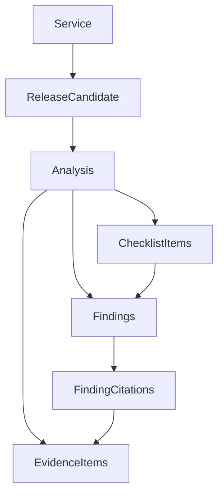

# Phase 2: evidence → policy → saved report

## The one idea to learn

**A release decision is a function of evidence and a policy version.** The API and database arrange the work; neither should decide what a failed check means. Later GitHub collectors and AI explanations will plug into the same evidence boundary.

Try all three scenarios at `/analyses/new` after creating a service. Each report is clearly labeled as synthetic evidence, not an assessment of that service's actual code.

| Fixture | Recommendation | Risk | Confidence | Why |
| --- | --- | --- | --- | --- |
| Safe release | GO | 0 | 100 | Complete evidence and all required checks pass. |
| Failed required CI | NO_GO | 48 | 100 | CI failure contributes 40; migration heuristic contributes 8. |
| Missing evidence | CAUTION | 35 | 25 | No checks adds 25; no runbook adds 10. Only change data is available. |

High confidence can accompany NO_GO: we have strong evidence that a release is unsafe. Confidence is evidence coverage, not the probability that deployment succeeds.

## Read only these three important sections first

1. **`backend/app/scoring/schemas.py`: `EvidenceSnapshot`.** Pydantic validates the normalized facts before scoring: full SHA values, supported conclusions, known evidence IDs, unique check attempts, and runbook citation membership. This is the validation boundary you compared to Joi.
2. **`backend/app/scoring/engine.py`: `evaluate`.** A plain function inspects those facts, creates cited findings, caps category totals, calculates confidence, and chooses the recommendation. It has no database, HTTP, LLM, or GitHub calls. Read the required-check loop and the final recommendation branch first.
3. **`backend/app/analyses/service.py`: `create_demo_analysis`.** This wraps scoring in application behavior: verify the service belongs to the workspace, construct the fixture, evaluate it, save the result in one transaction, and return the persisted report. Reading a report does not rerun scoring.

## PostgreSQL compared with MongoDB

A MongoDB implementation might embed evidence and findings inside one analysis document. Here we model the report's relationships explicitly:



`finding_citations` is a join table: one finding can cite several evidence items, and several findings can cite the same evidence. Foreign keys ensure those records exist. The backend additionally validates that citations belong to the report's own evidence snapshot.

PostgreSQL can also store JSON. `analyses.input_facts` holds variable-shaped normalized facts, and `score_details` holds the category/coverage breakdown. Those JSON fields do not replace the relational evidence/findings/citations. This is a small example of choosing a representation by how it will be queried.

The new Alembic migration adds seven tables without changing the Phase 1 tables. A transaction ensures a reader never receives half a report.

## Policy v1 defaults

- Risk categories cap at tests 40, code/review 25, change complexity 20, and documentation 15.
- Any failed/timed-out current required check or target-SHA mismatch is a hard blocker.
- Only `success` satisfies a required check. Pending, cancelled, neutral, skipped, and missing cannot produce GO.
- The latest explicit attempt is current; a successful rerun retains earlier failures as a five-point flakiness warning.
- NO_GO: any blocker or total risk ≥60. CAUTION: risk ≥30, confidence <75, incomplete mandatory collection, or required checks not verified passing. Otherwise GO.
- Confidence weights are changes 25, reviews 20, CI 30, runbooks 25. Each component is all-or-nothing in v1. A failed check is observed evidence, so failure itself does not lower confidence.
- Missing runbooks alone can still permit GO at 75 confidence and 10 risk if all mandatory GitHub evidence is complete and passing. Missing migration guidance adds risk. This is an explicit v1 policy choice, not a claim that documentation is optional for every real team.
- Large changes: more than 20 files or 1,000 changed lines adds 5; above 100 files or 5,000 lines adds 10. Path-based migration/auth/config detection is labeled as a heuristic.
- Backup/rollback text is guidance, never proof that someone executed those steps.
- Scores do not decrease below zero. Positive signals add context, not negative risk points.

## Two small experiments

1. **Follow a blocker:** create the failed-CI report. Open the integration-test citation. Find `required_failed` in the engine and inspect the 40-point rule. The report is NO_GO even though total risk is below 60 because the blocker takes precedence.
2. **Change one fact:** in a scratch Python session, take the safe fixture, change a check to pending, revalidate, and evaluate:

```python
from app.analyses.fixtures import fixture
from app.scoring.schemas import EvidenceSnapshot
from app.scoring.engine import evaluate

raw = fixture("safe").model_dump()
raw["ci"]["checks"][0]["conclusion"] = "pending"
result = evaluate(EvidenceSnapshot.model_validate(raw))
print(result.recommendation, result.risk_score, result.confidence_score)
# CAUTION 20 100
```

The confidence stays high: we know the check is pending. The readiness condition still fails.

## API types and retries

`frontend/lib/generated/api.d.ts` is generated from the FastAPI OpenAPI document, rather than maintaining a second handwritten report schema. `frontend/lib/api.ts` exports convenient aliases and handles fetch errors. Generated TypeScript protects development-time usage; Pydantic still performs runtime validation.

The demo creation endpoint requires `Idempotency-Key`. Repeating the same key and input returns the saved analysis; reusing the key with changed input returns 409. The database uniqueness constraint handles racing requests. This is request idempotency only; durable jobs, leases, outbox publishing, and crash recovery arrive in Phase 5.

## Current limits

Fixtures execute synchronously and call no external provider or model. Reports are immutable through the API. Checklist items are suggested actions, with no completion mutation or deployment authority. UI fixtures are test data; real GitHub evidence arrives in Phases 3–4. The full 18-scenario AI evaluation suite remains Phase 11 work.

Next: connect GitHub and resolve real refs into immutable SHAs, while retaining this scoring engine.

## Verified at this checkpoint

- 48 backend tests pass, including the Phase 1 tests; repeated against PostgreSQL.
- Seven frontend tests pass for forms and report/citation behavior.
- Python/TypeScript lint and type checks pass; Linux production container builds pass.
- Migration upgrade, downgrade to Phase 1, and schema-drift checks pass against a disposable database.
- All three fixtures return their expected scores through the running frontend proxy; repeated request keys return the same saved reports.
- All three reports remain identical after restarting PostgreSQL, API, and frontend.
- Browser verification covers sign-in, saved report navigation, fixture creation, the citation drawer, Escape dismissal, and focus return.
- A separate `ReleasePilot fixture demo` service holds the sample reports. Existing services were preserved.
- GitHub Actions is configured, including generated-contract drift checks, but has not run remotely.
